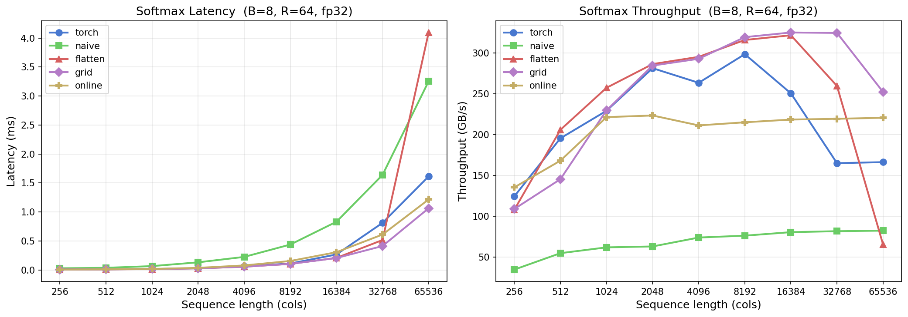
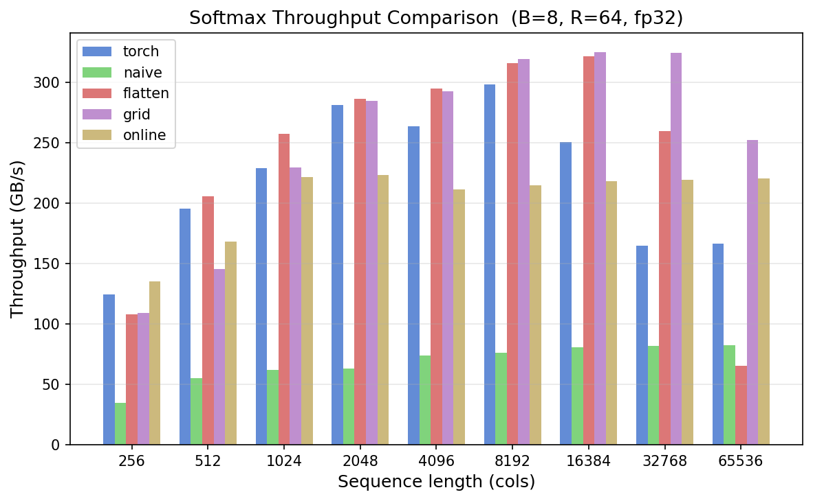
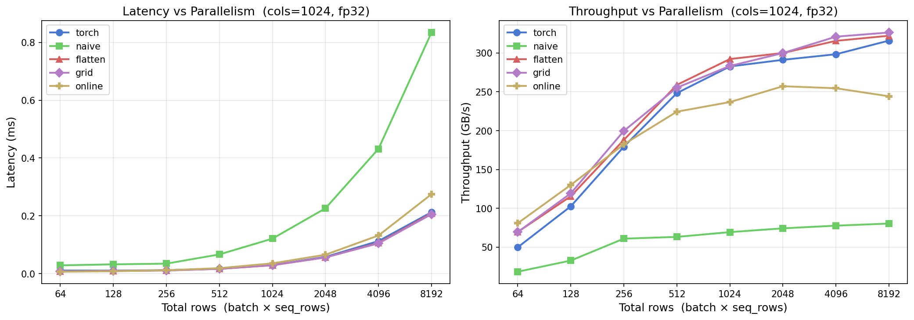
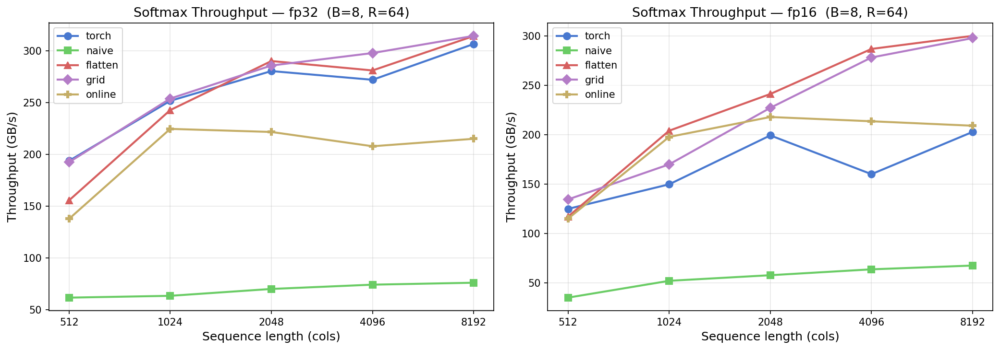
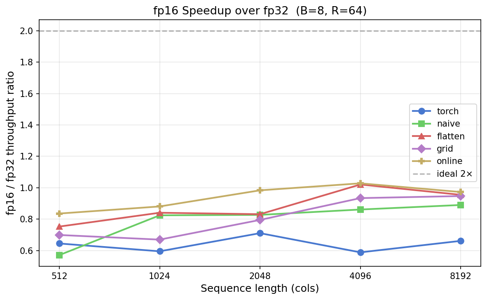

# Softmax — Triton Practice

Five softmax implementations: pure PyTorch → custom Triton kernels.

---

## Implementations

| File | Method | How it works |
|---|---|---|
| `03_naive_softmax.py` | **naive** | Pure PyTorch — separate max, exp, sum, divide ops |
| `02_3d_softmax_flatten.py` | **flatten** | Triton — reshape to `(N_rows, cols)`, one program/row, single pass |
| `02_3D_softmax_grid.py` | **grid** | Triton — explicit `(batch, rows)` 2D grid, stride-based indexing, single pass |
| `01_online_softmax.py` | **online** | Triton — two-pass tiled: pass 1 = running max+sum, pass 2 = write output |

**Online update rule (pass 1, per tile):**
```
d_new = d * exp(m - m_new) + sum(exp(tile - m_new))
```
Processes rows in tiles — handles arbitrarily large `cols` without storing the full row.

---

## Run

```bash
python softmax/benchmark.py        # runs all benchmarks, saves plots → softmax/plots/
```

---

## Benchmarks

> Config: **B=8, R=64 (512 total rows), fp32** unless stated.

---

### 1. Latency & Throughput vs Sequence Length



| Observation | Why |
|---|---|
| `naive` reaches ~4ms at cols=65536 | Launches 4 separate CUDA kernels per call — 4× memory round-trips |
| `flatten` / `grid` hit ~320 GB/s up to cols=16384 | Single fused kernel, one read + one write |
| `flatten` collapses at cols≥32768 | BLOCK_SIZE=32768 floats = 128KB register pressure — compiler struggles |
| `grid` holds ~250 GB/s at cols=65536 | Same block size but explicit stride indexing, no reshape |
| `online` plateaus at ~215 GB/s from cols=1024 | Reads input twice → 3N DRAM traffic vs 2N → `215/320 ≈ 0.67 = 2/3` |

---

### 2. Throughput Comparison (Grouped Bar)



- `flatten` and `grid` **beat torch** at all cols ≥ 512
- `online` flat bar ~215 GB/s regardless of cols — memory-traffic bound, not size-bound
- `naive` never exceeds ~80 GB/s — redundant DRAM ops

---

### 3. Throughput vs Parallelism (Row Scaling)

> Fixed `cols=1024`, sweep `total_rows` 64 → 8192



- **rows ≤ 256** → all fused kernels launch-latency bound (~50–130 GB/s), look identical
- **rows ≥ 512** → throughput rises sharply as more SMs fill
- **Plateau at ~1024–2048 rows** → GPU fully saturated, diminishing returns beyond this
- `naive` never saturates — multiple dispatches per call block full utilization
- `online` saturates ~60 GB/s below single-pass — same 2-pass penalty applies

---

### 4. fp16 vs fp32 Throughput



- **fp32 (left):** `flatten`/`grid`/`torch` cluster at ~300–315 GB/s
- **fp16 (right):** barely any improvement — no 2× speedup. `torch` fp16 is **slower** than fp32

---

### 5. fp16 Speedup Ratio



- **No kernel reaches ideal 2×** — all between 0.6× and 1.05×
- `torch` fp16 = **0.6–0.7×** — PyTorch upcasts fp16→fp32 internally for numerical stability
- `flatten`/`grid`/`online` reach ~1.0× at large cols — fp16 just breaks even
- Root cause: at B=8 R=64 the tensors are small (~1–8 MB). `exp` compute and kernel launch dominate over DRAM bandwidth. fp16 only wins when the kernel is purely memory-bandwidth bound at large scale.

---

## Summary

| Question | Answer |
|---|---|
| Fastest overall | `flatten` / `grid` — beat torch at cols ≥ 512 |
| Best at very large cols (≥32K) | `grid` — survives register pressure that kills `flatten` |
| When to use `online` | cols > register limit, or streaming without full-row SRAM allocation |
| fp16 worth it? | Not at this batch size — need much larger tensors to see BW-bound gains |
| Avoid | `naive` — ~4× slower, always |
